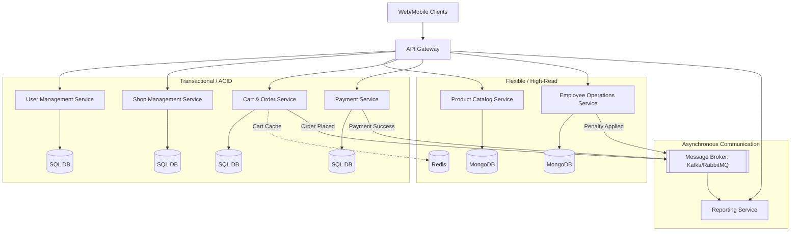
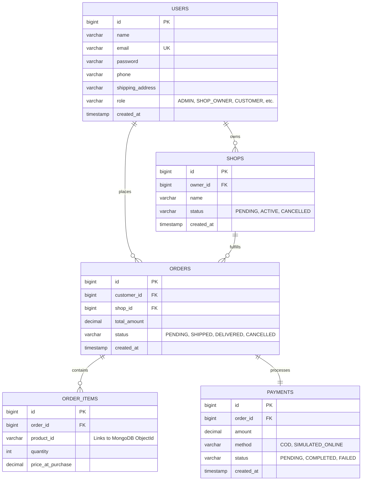

# Mall Management System: System Design & Database Schema

This document outlines the high-level architecture and database schema design for the Mall Management System. Based on your technology preferences, we're adopting a **Polyglot Persistence strategy**, utilizing both **SQL (Relational)** for strict transactional data and **MongoDB (NoSQL)** for high-read/flexible schema data.

---

## 1. High-Level Architecture

The system follows an event-driven, distributed microservices architecture. Services communicate synchronously via REST/gRPC and asynchronously using a message broker (e.g., Kafka or RabbitMQ) to decouple operations.



---

## 2. Microservice Breakdown & Database Choices

> [!NOTE]
> Why both databases? SQL is perfect for financial data, orders, and structured user management where ACID properties are mandatory. MongoDB excels in product catalogs (where attributes vary wildly by category) and document-heavy models like feedback and reports.

| Microservice | Primary Database | Justification |
|---|---|---|
| **User Management** | SQL (PostgreSQL/MySQL) | Highly structured data, strict constraints, foreign key mappings not heavily required but data is flat and rigid. |
| **Shop Management** | SQL (PostgreSQL/MySQL) | Needs strong transactional integrity for shop approvals, linking directly to User IDs. |
| **Product Catalog** | MongoDB | Products have dynamic attributes (e.g., Electronics have RAM/CPU; Clothing has Size/Color). NoSQL avoids complex EAV (Entity-Attribute-Value) anti-patterns in SQL. |
| **Cart & Order** | SQL + Redis | Redis for high-speed, temporary Cart storage. SQL for immutable, ACID-compliant Order records. |
| **Payment Service** | SQL | Financial transactions demand strict ACID guarantees and rollback capabilities. |
| **Employee Ops** | MongoDB | Complaints, resolutions, and varied return proofs map perfectly to flexible JSON documents. |
| **Reporting** | MongoDB / Blob | Reports aggregate data across the system. MongoDB handles large aggregated JSON structures well. |

---

## 3. Database Schemas

### 3.1 SQL Schemas (Relational)

> [!IMPORTANT]
> All SQL tables must have indexed `id` fields. Foreign keys to NoSQL collections (like `product_id`) are stored as plain strings in SQL, relying on application-level integrity.



### 3.2 MongoDB Schemas (NoSQL)

> [!TIP]
> In MongoDB, prefer embedding data that is queried together, but use references (ObjectIds) for unbounded growth (like products in a shop).

#### Product Catalog Service
**Collection: `categories`**
```json
{
  "_id": "ObjectId",
  "name": "Electronics",
  "description": "Gadgets and devices",
  "subcategories": [
    { "_id": "ObjectId", "name": "Smartphones" },
    { "_id": "ObjectId", "name": "Laptops" }
  ]
}
```

**Collection: `products`**
```json
{
  "_id": "ObjectId",
  "shopId": "101", // Relates to SQL Shop ID
  "categoryId": "ObjectId",
  "subcategoryId": "ObjectId",
  "name": "iPhone 15 Pro",
  "description": "Latest Apple smartphone",
  "price": 999.99,
  "stock": 50,
  "status": "ACTIVE", // ACTIVE, DEFECTIVE
  "attributes": { // Flexible schema benefits shine here
    "color": "Titanium",
    "storage": "256GB",
    "screen_size": "6.1 inches"
  },
  "createdAt": "ISODate"
}
```

#### Employee Operations Service
**Collection: `complaints`**
```json
{
  "_id": "ObjectId",
  "customerId": "55", // Relates to SQL User ID
  "shopId": "101",
  "orderId": "5001",
  "issue": "Late delivery and damaged packaging",
  "status": "RESOLVED",
  "resolutionDetails": "Refunded shipping cost",
  "handledByEmployeeId": "12",
  "createdAt": "ISODate",
  "resolvedAt": "ISODate"
}
```

**Collection: `returns_and_penalties`**
```json
{
  "_id": "ObjectId",
  "shopId": "101",
  "orderId": "5001",
  "productId": "ObjectId",
  "returnReason": "Defective screen",
  "status": "APPROVED",
  "warningIssued": true, // Triggers penalty rule
  "handledByEmployeeId": "14",
  "createdAt": "ISODate"
}
```

---

## 4. Cross-Service Business Workflows

### 4.1 Shop Deactivation Rule (Penalty System)
As per the requirements: *Returns > 5% → Warning → Next Return → Cancellation.*
1. **Product Manager** approves a return in Employee Ops Service (MongoDB).
2. Service publishes `ReturnApprovedEvent` to message broker.
3. Employee Ops Service listens to its own event, calculates the shop's return rate.
4. If threshold crossed, Employee Ops emits `ShopWarningIssuedEvent` or `ShopCancellationTriggeredEvent`.
5. **Shop Management Service** consumes `ShopCancellationTriggeredEvent` and updates the Shop status in SQL to `CANCELLED`.
6. **Product Catalog Service** consumes the event and bulk updates `status: CANCELLED` for all products belonging to that `shopId` in MongoDB.

### 4.2 Distributed Transactions (Saga Pattern)
When placing an order, multiple databases are involved. We use a **Choreography-based Saga**:
1. **Order Service** creates Order (`PENDING` - SQL).
2. Emits `OrderCreatedEvent`.
3. **Product Catalog Service** listens, reduces stock (MongoDB). If out of stock, emits `ProductReservationFailedEvent` (triggers Order cancellation).
4. If stock reserved, **Payment Service** processes payment (SQL). Emits `PaymentCompletedEvent`.
5. **Order Service** updates status to `CONFIRMED`.

> [!WARNING]
> Because SQL and MongoDB don't share distributed transactions, the Saga pattern (with compensating transactions like restoring stock) is mandatory to prevent data inconsistencies during checkout failures.
